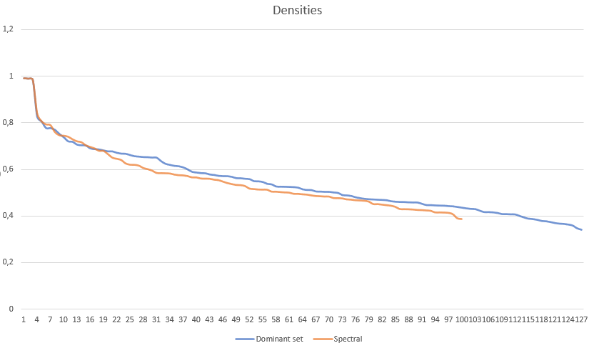

# Movie clustering

This repository is a collection of scripts to cluster movies according to the users who watched them.

## Data source
The source of the data is an online service accessible via https://everyfad.com/movies or the Android app [MoviesFad](https://play.google.com/store/apps/details?id=fema.moviesfad).

In order to run code in this project, you need to have access to this database and to some libraries that facilitate the reading of the data. 
At the moment, those resources are not public. 

For this project, I considered the 20000 most active users and the 10000 most watched movies. The data was taken in April 2020.

The data is about how many times each of those users watched each of those movies.

## Clustering methods
This project aims to show the differences between spectral clustering and dominant sets clustering for clustering movies.

## Data representation
The most natural embedding of movies in this context is to use the N dimensionality space, with N=20000, in which each dimension is a different user. The value of each dimension is proportional to the logarithm of how many times the user watched a particular movie.  
Using the logarithm allows to reduce the effect of noise and glitches: for example the data imported from a particular external service contained a lot of repetition, so for example it may appear that an user watched the same movie dozens of times.

For this project, I choose to use a pairwise clustering approach, i.e. clustering movies according to their pairwise similarities instead of directly using this high dimensionality representation.  
This similarity is the result of the Gaussian kernel applied to the cosine distances between movies. 

### Preliminary considerations

Since the data comes from real viewings that user logged in an Android application, there are some biases. In particular:
 - Users are movie lovers, that may consume more movies than the average person
 - The application is relatively new, so old viewings may not be logged inside the application
 - Users are mainly italian or from the U.S.A. This may favours movies from those countries.
  
 Those biases create some pattern in the data that may skew the clustering results. In particular, some features that are not intrinsic to the movie may dominate the classification strategy. Those features are:
 - Being a recent movie with a theatrical release
 - Being a very popular movie
 - Being a "classic"
 
 Those biases are so strong that are clearly visible from the similarity matrix. For example, this image represents the pairwise similarities among the 200 most popular movies (the brighter the pixel, the higher the similarity).  
  
 As expected, basically all pairs have a high similarity, since the most popular movies have been watched by basically all users.
 
## Dominant sets clustering
For the purpose of this project, the simpler version of dominant set clustering was used: the discrete replicator dynamics algorithm in combination with the peel off strategy.  
The peeling was repeated until all data was clustered. This created a partition among all movies.

One of the advantages of Dominant sets clustering is that there are not much hyper parameters. Nonetheless, a big factor for obtaining good results is to use a good criterion to stop the iteration of the replicator dynamic. Since the payoff matrix is symmetric, theory ensures that each iteration step will improve the clustering result. This fact, along with some testing, created the following stop condition. The iteration continues when it satisfies at least one of those criteria:
- I'm in the first 5000 iterations, and the distance is bigger than `10 ^ -6` (the distance refers to how much the population share moved in one iteration)
- I'm in the first 50000 iterations, and the cluster still contains more than half of the dataset
- In the last 25 iterations at least an element has been removed from the cluster.

Another parameter to choose is the minimum value in order to consider an element as a member of the cluster. After some experiments, choosing `10 ^ -100` seems a good choice. This makes sense, given the game theory interpretation of that number. 

## Spectral clustering
Unlike Dominant set, spectral clustering requires the number of clusters as a parameter. Given the results obtained from the dominant set clustering, I choose `100`.

## Results
Before diving into the differences in the actual results, the two clustering algorithm have some intrinsic differences:
- Like already mentioned, the number of clusters for dominant set comes directly from the data
- Dominant set extract clusters in the order of how "prominent" the cluster is.
- Elements inside dominant set's clusters have an intrinsic metric proportional to how much they belong to the cluster. 

These are nice property that makes dominant sets more suitable for clustering movies. Especially the first two properties allows excluding movies that don't belong to any clear cluster.

### Qualitative evaluation
Before looking at more measurable metrics to determine quality of the clusters, I observed the results of both algorithms. 

For both clustering algorithms:
- Excluding the USA, movies that are from a specific nation are clustered together, regardless of the actual properties of movie. This includes for example italian or indian films. 
- Some movie collections are perfectly clustered, for example the Pokémon, Dragonball and, Scooby-Doo movies. 
- Some very similar movie collections are clustered together. For example, all the Halloween, Hellraiser, Friday the 13th, Nightmare, Chucky, The Texas Chainsaw Massacre and Child's Play are clustered together. These are all horror sagas.

For Spectral clustering:
- Only 26 out of 100 clusters contained movies that I considered very similar
- 45 out of the 100 clusters didn't exhibit any clear pattern about their content 

For Dominant sets clustering:
- The first cluster contains very popular movies, that have not much in common.
- 60 out of 126 clusters contained movies that I considered very similar
- Only 21 out of 126 clusters didn't exhibit any clear pattern about their content

It's obvious that some of those observations are very subjective, but nonetheless they portray a clear picture: dominant set seems to produce better qualitative results.

### Quantitative evaluation
To measure the quality of clusters, I used measured and plotted the average density of each subgraph, and the average distance between all pairs of subgraphs.

#### Intra cluster similarities
  

This plot shows the clusters on the x axis and the density (average similarity) on the y axis.  
It's interesting to note that both algorithms produce very similar result, and both algorithms produced 3 clusters in which the average similarity is almost `1`, meaning they were watched by the same users.  
Dominant sets produced slightly better results after the 20th cluster.

#### Inter cluster similarities
The average Inter cluster similarity between clusters (the average similarity between all pairs of movies of two different clusters) is `0.384` for dominant set clustering and `0.394` for spectral clustering.  
Again, very similar numbers, but slightly better for dominant sets.

These images represent a `cluster x cluster` matrix, in which the brightness of each pixel is proportional to the average similarity between the two clusters.  

For dominant sets:  
  

For spectral clustering:  
  

Horizontal or vertical bright or dim lines correspond to clusters that are respectively very similar or very dissimilar to every other cluster.  
Dominant set clustering has more of these dimmed lines, which means that more clusters are very well separated from other clusters.

It's especially impressive that dominant sets produce lower inter clusters similarities with respect to spectral clustering, considering that the latter algorithm derives directly from the problem of minimizing normalized cuts between clusters, a measure that is very related to this benchmark. 

## Conclusion
Both qualitative and quantitative observations favors the results produced by dominant set clustering.  